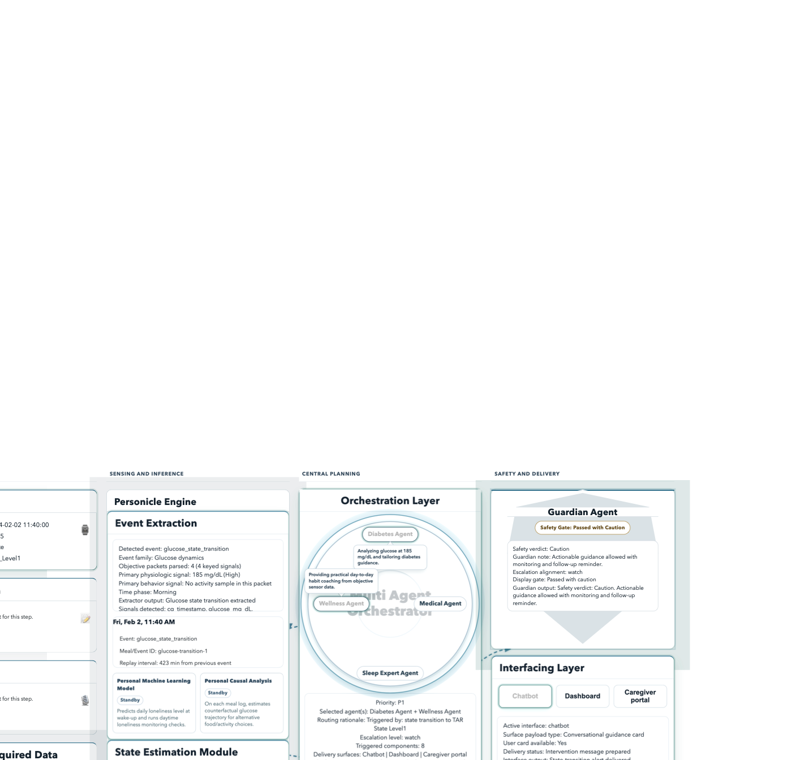

# PCU MVP

PCU MVP is a minimal end-to-end prototype for a Personal Chronic-care Unit workflow. It combines a runnable demo UI, a lightweight backend that emits paper-aligned PCU outputs, and a synthetic-data preparation pipeline that builds PCU-ready multimodal inputs from two real datasets.

[](docs/demo/playback/pcu_demo_playback.pdf)

Full UI playback and screenshots: [`docs/demo/playback/pcu_demo_playback.pdf`](docs/demo/playback/pcu_demo_playback.pdf)

## Highlights

- a runnable MVP app under `mvp/`
- a synthetic-data preparation pipeline under `data_pipeline/`
- documentation that explains how the PCU demo and synthetic dataset are constructed
- explicit publishing rules that keep raw source datasets out of the public repo

The current local workspace also contains raw and generated datasets under `mergedataPCU/`, plus a local synthetic participant folder at `CGMacros-015/`. Those data directories are intentionally treated as local artifacts first and GitHub content second.

## MVP Demo

The demo represents a PCU workflow with:

- event extraction and state estimation over glucose, activity, and sleep streams
- knowledge-grounded guidance generation
- orchestration and guardian layers for agent routing and safety framing
- multiple interface modes, including chatbot, dashboard, and caregiver portal views

## Repository Layout

```text
.
├── README.md
├── data/
│   ├── README.md
│   └── sample_synthetic/
├── data_pipeline/
│   ├── README.md
│   ├── met_day_match_dtw.py
│   ├── warp_loneliness_to_cg.py
│   └── scripts/
├── docs/
│   ├── architecture.md
│   ├── data-governance.md
│   ├── synthetic-data.md
│   ├── demo/
│   └── design/
├── mergedataPCU/
│   ├── CGMacros/
│   ├── LONELINESS-DATASET/
│   └── output/
└── mvp/
    ├── backend/
    ├── scripts/
    └── ui/
```

## What Belongs In GitHub

Commit these by default:

- `mvp/`
- `data_pipeline/`
- `docs/`
- `data/README.md`
- project metadata such as `.gitignore` and `pyproject.toml`

Do not commit by default:

- raw source datasets in `mergedataPCU/CGMacros/`
- raw source datasets in `mergedataPCU/LONELINESS-DATASET/`
- generated synthetic outputs in `mergedataPCU/output/`
- local sample data in `CGMacros-015/`
- legacy materials in `archive/old_pcu_simple_using_tom/`

Review the policy in `docs/data-governance.md` before the first public push.

## Quick Start

### Run the MVP app

```bash
python -m mvp.backend.server --port 8000
```

Then open `http://localhost:8000/mvp/ui/`.

Try:

```bash
http://localhost:8000/mvp/ui/?dataset=CGMacros-015
```

### Build the synthetic alignment artifacts

```bash
python data_pipeline/met_day_match_dtw.py
python data_pipeline/warp_loneliness_to_cg.py
python data_pipeline/scripts/detect_cgm_events.py
```

By default, those commands read from the local raw-data staging area under `mergedataPCU/` and write outputs to `mergedataPCU/output/`.

## Synthetic Data Pipeline

The synthetic PCU-ready dataset is built by combining two real datasets:

- `CGMacros` for glucose-centered participant-day records
- `LONELINESS-DATASET` for behavioral, EMA, Oura, Samsung, and AWARE streams

The pipeline:

1. matches participant-days by normalized hourly MET profile similarity
2. aligns minute-level activity traces using dynamic time warping
3. warps the source-study timestamps onto the CGMacros timeline
4. derives CGM event labels for each synthetic participant

See `docs/synthetic-data.md` and `data_pipeline/README.md` for the full method and provenance model.

## Documentation Map

- `docs/architecture.md`: PCU MVP system overview and runtime structure.
- `docs/synthetic-data.md`: how the synthetic PCU-ready dataset is created from two real datasets.
- `docs/data-governance.md`: what to publish, what to exclude, and how to describe provenance.
- `data_pipeline/README.md`: exact pipeline inputs, outputs, and commands.
- `docs/demo/`: demo playback artifacts and narrative materials.
- `docs/design/`: original design notes kept for reference.
